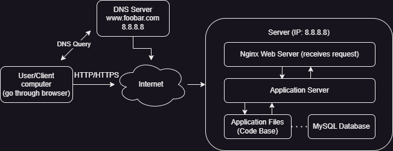

## 0-simple_web_stack

### Infrastructure Component Explanations

- ***What is a server?***

A server is a physical or virtual computer system dedicated to running software services to serve the needs of clients. In this infrastructure, the server (with IP 8.8.8.8) is a single physical machine that hosts all the necessary components to run the website: web server, application server, application files, and database.

- ***What is the role of the domain name?***

The domain name (foobar.com) serves as a human-readable address that points to the server's IP address. It provides a memorable way for users to access the website without having to remember the numeric IP address (8.8.8.8). Domain names are part of the Domain Name System (DNS), which translates these names into IP addresses.

- ***What type of DNS record www is in www.foobar.com?***

The www in www.foobar.com is a subdomain that is typically configured as a CNAME (Canonical Name) record or an A record. In this case, it's likely an A record that points directly to the IP address 8.8.8.8. A CNAME record would point to another domain name, while an A record points directly to an IP address.

- ***What is the role of the web server?***

    The web server (Nginx in this case) handles HTTP requests from users' browsers. Its primary functions include:

    - Receiving and processing incoming network requests
    - Serving static content (like HTML, CSS, images)
    - Forwarding dynamic content requests to the application server
    - Managing SSL/TLS for secure connections
    - Handling load balancing (though in this single-server setup, there's no load balancing)

- ***What is the role of the application server?***

    The application server executes the business logic of the website. It:

    - Processes dynamic content requests forwarded by the web server
    - Runs the application code (such as PHP, Python, Ruby, etc.)
    - Interacts with the database to retrieve or store data
    - Generates dynamic content to be sent back to the user
    - Handles authentication, sessions, and other application-specific processes

- ***What is the role of the database?***

    The MySQL database stores and manages the website's data. It:

    - Persistently stores structured data (user information, content, settings, etc.)
    - Processes queries from the application server
    - Ensures data integrity and consistency
    - Manages data relationships
    - Handles transactions and concurrent access

- ***What is the server using to communicate with the user's computer?***

The server communicates with the user's computer using the HTTP (Hypertext Transfer Protocol) or HTTPS (HTTP Secure) protocols over the TCP/IP network protocol suite. This communication happens over the internet and allows the transfer of web pages, images, scripts, and other resources between the server and the user's browser.

- ***Issues with This Infrastructure***

    - **Single Point of Failure (SPOF)**
    This infrastructure has a single server handling all components (web server, application server, database). If this server fails due to hardware issues, network problems, or any other reason, the entire website becomes unavailable. There's no redundancy or failover mechanism.

    - **Downtime During Maintenance**
    When maintenance is required (such as deploying new code, updating the web server, or performing security patches), the server or specific services must be restarted. During this time, the website will be inaccessible to users, causing downtime. With only one server, there's no way to perform maintenance without affecting availability.

    - **Limited Scalability**
    With all components on a single server, there's a limit to how much traffic the website can handle. If the site experiences a sudden surge in visitors (like during a marketing campaign or viral content), the server may become overwhelmed, leading to slow performance or complete failure. The infrastructure cannot easily scale horizontally (adding more servers) to handle increased load.

## 1-distributed_web_infrastructure

### Infrastructure Component Explanations (Part2)

- ***Load Balancer (HAproxy(High Availability Proxy)):***

    - Distributes incoming traffic across multiple servers
    - Improves reliability by preventing any single server from becoming overwhelmed
    - Enables horizontal scaling by adding more servers when needed
    - Provides failover capability if one server goes down

- ***Second Server:***

    - Eliminates the single point of failure from the previous design
    - Increases the capacity to handle more concurrent users
    - Provides redundancy in case one server fails
    - Enables continuous service during maintenance of one server

- ***Primary-Replica Database Setup:***

    - Improves data reliability through replication
    - Enables read scaling by allowing reads from the replica
    - Provides data backup in case the primary database fails
    - Allows for database maintenance with minimal downtime

- ***Active-Active Setup (what this design uses):***

    - All servers are actively handling requests simultaneously
    - Traffic is distributed across all available servers
    - Maximum resource utilization as all servers are working
    - Higher throughput and better performance under normal conditions
    - If one server fails, the others continue to work (with increased load)

- ***Active-Passive Setup:***

    - Only the active server handles requests while the passive server(s) remain on standby
    - Passive servers only become active if the primary active server fails
    - Resources of passive servers are underutilized during normal operation
    - Simpler to implement but less efficient use of resources
    - Provides high availability with potentially less complexity

- ***Database Primary-Replica Cluster***

    - The Primary node (Master) accepts write operations from the application
    - All changes to the Primary are recorded in the binary log
    - The Replica node (Slave) continuously replicates data from the Primary
    - Replication is typically asynchronous (changes on Primary first, then propagated to Replica)
    - The Replica can serve read queries to distribute database load

- ***Differences between Primary and Replica nodes:***

    **Primary Node:**

    - Handles all write operations (INSERT, UPDATE, DELETE)
    - Can handle read operations
    - Contains the authoritative, most up-to-date data
    - If it fails, a promotion process is needed to make a Replica the new Primary

    **Replica Node:**

    - Handles read operations only (typically)
    - Contains a copy of the data from the Primary
    - May have slightly delayed data due to asynchronous replication
    - Can be promoted to Primary if the original Primary fails

- ***Issues with This Infrastructure***

    **Single Points of Failure (SPOF):**

    - The load balancer is still a SPOF (if it fails, the entire system becomes inaccessible)
    - The DNS server could be a SPOF depending on its implementation
    - If using a single Primary database, it's a SPOF for write operations

    **Security Issues:**

    - No firewall to filter and monitor network traffic
    - No HTTPS, meaning data is transmitted in plain text
    - No mention of secure authentication mechanisms for server access

    **No Monitoring:**

    - No way to detect performance issues before they become critical
    - No alerts for server failures or resource exhaustion
    - No visibility into system health and application performance
    - No tracking of security events or potential breaches
    - No historical data for capacity planning and problem analysis

## 2-secured_and_monitored_web_infrastructure

### Infrastructure Component Explanations (Part3)

- ***Firewalls:***

    **Purpose:** To control and filter incoming and outgoing network traffic based on predetermined security rules

    **Why Add Them:**
    - Protect the infrastructure from unauthorized access and cyber attacks
    - Filter malicious traffic before it reaches your servers
    - Create security zones within your network architecture

- ***Placement:***

    - Between internet and load balancer (protects entire infrastructure)
    - Between load balancer and each server (adds defense in depth)

- ***SSL Certificate:***

    **Purpose:** Enables HTTPS encryption for secure communication

    **Why Add It:**

    - Protects data in transit between users and your servers
    - Establishes trust with users through verified identity
    - Improves SEO ranking (Google favors HTTPS sites)
    - Required for many modern web features (like HTTP/2, certain APIs)

- ***Monitoring Clients:***

    **Purpose:** Collect performance and health data from each component

    **Why Add Them:**

    - Provide visibility into system performance and health
    - Enable early detection of issues before they become critical
    - Support capacity planning and optimization
    - Track security events and potential breaches

- ***What Are Firewalls For?***

    Firewalls are security devices that monitor and filter incoming and outgoing network traffic based on an organization's previously established security policies. They act as a barrier between a trusted network and an untrusted network (like the internet).

    **Key functions:**

    - *Traffic Filtering:* Examines packets and blocks those that don't meet the specified security criteria
    - *Access Control:* Restricts unauthorized access to private networks
    - *Packet Inspection:* Can examine the content of packets to identify and block malicious code
    - *Logging and Monitoring:* Records traffic information and suspicious activities
    - *Network Segmentation:* Creates boundaries between different parts of your network for additional security

- ***Types of firewalls in this infrastructure:***

    **Network Firewall** (between internet and load balancer): Protects the entire infrastructure
    **Host-based Firewalls** (between load balancer and servers): Provides additional protection for individual servers

- ***Why is Traffic Served Over HTTPS?***

    HTTPS (HTTP Secure) encrypts the data exchanged between users and your website, providing several important benefits:

    - Data Confidentiality: Prevents eavesdropping by encrypting all data transmitted
    - Data Integrity: Ensures data isn't modified in transit
    - Authentication: Verifies that users are communicating with the actual website, not an impostor
    - User Trust: Shows users that you take security seriously (browsers show a padlock icon)
    - Regulatory Compliance: Required for handling sensitive data (like credit cards, personal information)
    - Modern Features: Required for many modern web features like HTTP/2 and certain browser APIs

- ***What Monitoring is Used For?***

    Monitoring is essential for maintaining a healthy and efficient infrastructure:

    - Performance Tracking: Measures response times, load times, and resource usage
    - Health Checking: Detects when services or servers become unavailable
    - Capacity Planning: Provides data to help determine when to scale resources
    - Troubleshooting: Helps identify the root cause of problems
    - Security Monitoring: Detects unusual patterns that might indicate breaches
    - Compliance: Ensures systems meet regulatory requirements
    - Alerting: Notifies administrators when metrics exceed thresholds

- ***How the Monitoring Tool is Collecting Data***

    Monitoring clients (data collectors) gather data using several methods:

    **Agent-based Collection**: Software installed on servers that:

    - Collects system metrics (CPU, memory, disk usage)
    - Monitors running processes
    - Checks service status
    - Accesses log files

    **Network-based Collection:**

    - Monitors network traffic and patterns
    - Checks connectivity between components
    - Measures response times

    **Application Performance Monitoring (APM):**

    - Tracks application-specific metrics
    - Monitors user experience data
    - Records transaction times

    **Log Collection:**

    - Gathers and centralizes log files
    - Parses logs for significant events
    - Correlates logs across multiple systems

    **The collected data is sent to a central monitoring service** (like Sumologic, Datadog, Nagios, etc.) for:

    - Analysis and visualization (dashboards)
    - Alert generation
    - Long-term storage for trend analysis

- ***How to Monitor Web Server QPS (Queries Per Second)***

    **Set Up Metrics Collection:**

    - Configure your monitoring agent to track HTTP request counts
    - Ensure Nginx access logs are being collected

    **Configure Dashboards:**

    - Create a dashboard showing requests per second
    - Set up time-based aggregation to show trends

    **Set Up Alerts:**

    - Create thresholds for normal, high, and critical QPS levels
    - Configure notifications when thresholds are exceeded

    **Additional Metrics to Consider:**

    - Error rates alongside QPS
    - Response times correlated with QPS
    - Server resource usage during high QPS periods

    **Implementation Example:**

    - In Nginx: Enable the stub_status module to expose metrics
    - Configure the monitoring agent to scrape these metrics
    - Set the appropriate collection interval (e.g., every 10 seconds)

- ***Issues with This Infrastructure***

    **SSL Termination at Load Balancer Level:**

    - Why it's an issue: Traffic between the load balancer and servers is unencrypted
    - Security risk: If the internal network is compromised, data is exposed
    - Compliance problems: May violate regulations requiring end-to-end encryption
    - Solution: Implement end-to-end encryption (re-encrypt after load balancer) or use network-level encryption between components

    **Single MySQL Primary for Writes:**

    - Why it's an issue: Creates a single point of failure for write operations
    - Scalability limitation: Write capacity is limited to a single server
    - Downtime risk: Maintenance or failure causes write capability to be lost
    - Solutions: Implement multi-master replication, database clustering, or automatic primary failover

    **Servers with Identical Components:**

    - Why it's an issue:

    - Resource contention: Database and web server compete for the same resources
    - Scaling inefficiency: Can't scale individual components based on their specific needs
    - Uniform vulnerability: A flaw affecting one component affects all servers
    - Maintenance challenges: Updates might require full server restarts

    **Solution:** Separate components onto specialized servers (database servers, application servers, web servers) for better resource allocation and scaling

## 3-scale_up

### Infrastructure Component Explanations (Part4)

Second Load Balancer in a Cluster:

Purpose: Creates high availability for the load balancing layer
Why Add It:

Eliminates the load balancer as a single point of failure
Allows for maintenance of one load balancer without downtime
Provides redundancy if one load balancer fails
Can share load during normal operation

How It Works:

Both load balancers monitor each other's health
They share a virtual/floating IP address that clients connect to
If one fails, the other takes over the floating IP automatically
Typically configured in active-passive or active-active mode

Split Components onto Specialized Servers:

Purpose: Separates web, application, and database functions onto dedicated servers
Why Add It:

Improved Resource Allocation: Each component has dedicated resources without competition
Independent Scaling: Can scale each tier based on specific needs (e.g., add more web servers for high traffic)
Improved Security: Creates separation between tiers, limiting potential breach impact
Specialized Optimization: Can optimize each server for its specific role
Targeted Maintenance: Can update or restart components without affecting others
Different Hardware Profiles: Can use different hardware specs for each role (e.g., high CPU for app servers, high memory for databases)

Specific Benefits of the New Architecture

Web Server Tier:

Optimized for handling HTTP requests and serving static content
Can be scaled horizontally by adding more web servers when traffic increases
Can be configured with caching specific to web content
Failure of one web server doesn't affect application logic or data

Application Server Tier:

Focused on business logic and application processing
Can be optimized for CPU and memory usage specific to application needs
Can be scaled based on computational demands rather than web traffic
Updates to application code don't require restarting web servers

Database Server Tier:

Dedicated resources for database operations
Can be optimized specifically for data storage and retrieval
Primary-Replica setup provides redundancy and read scaling
Database maintenance doesn't affect the availability of web or application servers

Load Balancer Cluster:

Provides high availability for the entry point to your infrastructure
Enables seamless failover if one load balancer goes down
Can be updated or maintained without service interruption
Typically uses heartbeat protocols to detect failures and coordinate failover

How the Clustered Load Balancer Works

Floating/Virtual IP (VIP):

A shared IP address that both load balancers can assume
The DNS entry for www.foobar.com points to this floating IP
Only one load balancer actively uses this IP at any given time (in active-passive setup)

Heartbeat Communication:

Load balancers constantly check each other's health
They exchange status messages to coordinate which one is active
If the active LB fails to send heartbeats, the passive one takes over

Synchronization:

Configuration is synchronized between both load balancers
Session data can be shared to maintain persistence during failover
State information is replicated to ensure seamless transitions

Takeover Process:

When a failure is detected, the surviving load balancer:

Claims the floating IP address
Sends gratuitous ARP messages to update network routing
Takes over all load balancing functions
No DNS changes are needed, making failover nearly instantaneous

How This Architecture Addresses Previous Issues

SSL Termination Issue:

You could implement end-to-end encryption by re-encrypting traffic between load balancers and web servers
Or implement network-level encryption between all components

Single MySQL Write Point Issue:

While still using a Primary-Replica setup, you can implement automatic failover
The architecture allows for adding more database servers or implementing clustering

Identical Server Components Issue:

Completely resolved by separating components onto specialized servers
Each tier can now be independently scaled, maintained, and optimized

Load Balancer SPOF Issue:

Resolved by implementing the load balancer cluster with automatic failover
